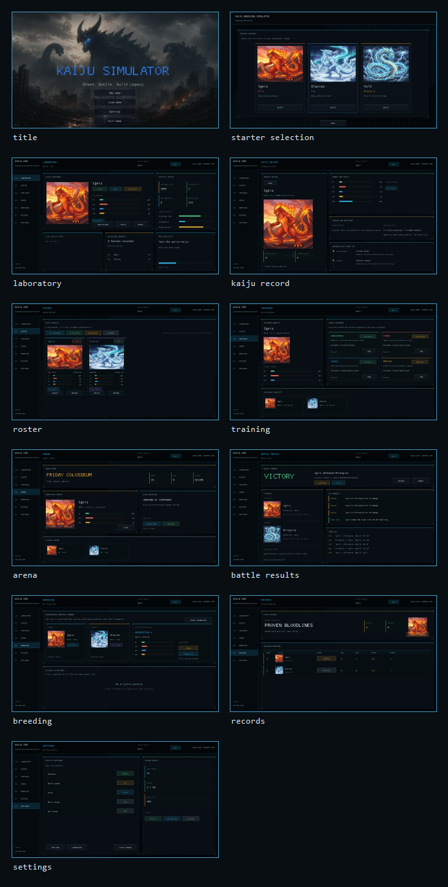

# Kaiju Breeding Simulator

Kaiju Breeding Simulator is a Rust/Macroquad monster breeding and auto-battler about training kaiju, fighting seeded arena battles, breeding new generations, and preserving each kaiju's event history.

## Current Scope

- local starter selection
- training
- AI arena battles
- breeding
- save/load
- kaiju detail records
- local leaderboard

V1 is offline-first and does not require a server.

## Screenshots



- [Title](screenshots/latest/01_title.png)
- [Starter selection](screenshots/latest/02_starter_selection.png)
- [Laboratory](screenshots/latest/03_laboratory.png)
- [Kaiju record](screenshots/latest/04_kaiju_record.png)
- [Roster](screenshots/latest/05_roster.png)
- [Training](screenshots/latest/06_training.png)
- [Arena](screenshots/latest/07_arena.png)
- [Battle results](screenshots/latest/08_battle_results.png)
- [Breeding](screenshots/latest/09_breeding.png)
- [Records](screenshots/latest/10_records.png)
- [Settings](screenshots/latest/11_settings.png)

## Run

```bash
cargo run
```

## Verify

```bash
cargo fmt
cargo check
cargo test
```

For web compatibility:
```bash
cargo check --target wasm32-unknown-unknown
```

## Core Docs

- `kaiju_sim.md`
- `IMPLEMENTATION_GUIDE.md`
- `GAMEPLAY_WALKTHROUGH.md`
- `KAIJU_HISTORY_DESIGN.md`
- `CODE_STANDARDS.md`
- `MACROQUAD_TOOLKIT.md`
- `AGENTS.md`
# Practical Future Improvements

- Add deterministic tests for training, breeding inheritance, battle multipliers, tournament rewards, and market purchases.
- Split roster, market, tournament, and laboratory mutation into service-like modules that screens call through explicit commands.
- Move kaiju species, stat curves, items, and reward tuning into validated data fixtures.
- Add replay fixtures for battles and tournaments to reproduce balance issues from seed and roster data.

