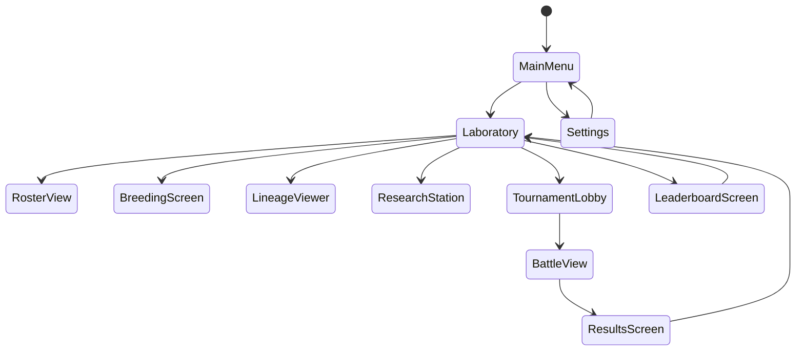

# Kaiju Breeding Simulator - UI/UX Specification

**Version**: 1.0
**Platform**: Macroquad + macroquad-toolkit
**Target**: WebGL (WASM) + Native Windows
**Last Updated**: 2026-01-10

---

## 1. Design Philosophy

### 1.1 Core Principles
- **Information-Dense but Scannable**: Players need quick access to complex data
- **Progressive Disclosure**: Hide complexity until relevant
- **Consequence Clarity**: Make risk/reward decisions obvious
- **Legacy Persistence**: Death and history are first-class visual elements
- **Trust Through Transparency**: All data should feel auditable

### 1.2 Visual Themes
- **Science Lab Aesthetic**: Clean, clinical, research-focused
- **Monster Card Game**: Collectible, tradeable creatures
- **Genetic Tree Visualization**: Ancestry and lineage prominence
- **Tournament Bracket**: Competitive sports feeling
- **Post-Apocalyptic Registry**: Permanent records, hall of fame

---

## 2. Screen Map & Navigation Flow

### 2.1 Screen Hierarchy

```
MainMenu
├── Laboratory (Hub)
│   ├── RosterView
│   │   └── KaijuDetailView (Modal)
│   ├── BreedingScreen
│   │   ├── ParentSelector
│   │   └── OffspringPreview
│   ├── LineageViewer
│   └── ResearchStation
├── TournamentLobby
│   ├── TournamentBrowser
│   └── EntryConfirmation (Modal)
├── BattleView
│   └── ResultsScreen
├── LeaderboardScreen
└── Settings
```

### 2.2 State Machine



---

## 3. Screen Specifications

### 3.1 MainMenu

**Purpose**: Entry point and game mode selection

**User Goals**:
- Start new game or continue existing
- Access settings
- View credits/version info

**Layout** (1280x720 base resolution):
```
┌─────────────────────────────────────────────────────┐
│                                                     │
│           🦖 KAIJU BREEDING SIMULATOR              │
│                                                     │
│              [  New Laboratory  ]                   │
│              [  Continue Game   ]                   │
│              [    Settings      ]                   │
│              [  Leaderboards    ]                   │
│              [     Credits      ]                   │
│                                                     │
│                                                     │
│  v1.0                         blockchain: offline   │
└─────────────────────────────────────────────────────┘
```

**Interactive Elements**:
- 5 primary buttons (200x50px each)
- Logo/title text (static)
- Version info (bottom-left)
- Connection status indicator (bottom-right)

**UiAction Returns**:
```rust
pub enum MainMenuAction {
    NewGame,
    Continue,
    OpenSettings,
    ViewLeaderboard,
    ViewCredits,
}
```

**Transitions**:
- `NewGame` → Laboratory (new state)
- `Continue` → Laboratory (loaded state)
- `OpenSettings` → Settings
- `ViewLeaderboard` → LeaderboardScreen

---

### 3.2 Laboratory (Hub Screen)

**Purpose**: Central hub for all breeding and research activities

**User Goals**:
- View owned kaiju roster
- Initiate breeding
- Research traits
- Access tournaments
- View lineage

**Layout**:
```
┌─────────────────────────────────────────────────────┐
│ [Roster] [Breed] [Research] [Lineage] [Tournament]  │
├─────────────────────────────────────────────────────┤
│                                                     │
│   🧬 LABORATORY - FACILITY LEVEL 3                 │
│                                                     │
│   ┌───────────┐  ┌───────────┐  ┌───────────┐    │
│   │ KAIJU #1  │  │ KAIJU #2  │  │ KAIJU #3  │    │
│   │  [Card]   │  │  [Card]   │  │  [Card]   │    │
│   │           │  │           │  │           │    │
│   └───────────┘  └───────────┘  └───────────┘    │
│                                                     │
│   Recent Activity:                                  │
│   • Stormling won Tournament (Ranked #4)           │
│   • Breeding rights expired for Reefmaw            │
│                                                     │
│  [Back to Menu]                    Gold: 1,250 💰  │
└─────────────────────────────────────────────────────┘
```

**Interactive Elements**:
- Tab navigation (5 tabs, 150x40px each)
- Kaiju card grid (3-4 per row)
- Activity feed (scrollable)
- Resource display (top-right)
- Back button

**UiAction Returns**:
```rust
pub enum LaboratoryAction {
    GoToRoster,
    GoToBreeding,
    GoToResearch,
    GoToLineage,
    GoToTournament,
    SelectKaiju(KaijuId),
    ReturnToMenu,
}
```

**Transitions**:
- All tabs transition to their respective screens
- Card clicks open KaijuDetailView (modal)

---

### 3.3 RosterView

**Purpose**: Browse and manage owned kaiju collection

**User Goals**:
- View all kaiju at a glance
- Compare stats
- Filter by status (alive/dead, generation)
- Select kaiju for breeding or tournaments

**Layout**:
```
┌─────────────────────────────────────────────────────┐
│ ROSTER                [Search] [Filter: All ▼]      │
├─────────────────────────────────────────────────────┤
│                                                     │
│ ┌──────────┐ ┌──────────┐ ┌──────────┐ ┌────────┐ │
│ │ Flossy   │ │Stormling │ │ Reefmaw  │ │Tidecal.│ │
│ │ Gen 4 ⚡ │ │ Gen 5 ⚡🌊│ │ Gen 4 🌊 │ │Gen 3 💀│ │
│ │ HP: 300  │ │ HP: 310  │ │ HP: 320  │ │(DEAD)  │ │
│ │ ATK: 60  │ │ ATK: 62  │ │ ATK: 55  │ │        │ │
│ │ DEF: 40  │ │ DEF: 38  │ │ DEF: 45  │ │        │ │
│ │ SPD: 30  │ │ SPD: 35  │ │ SPD: 25  │ │        │ │
│ │ [Select] │ │ [Select] │ │ [Select] │ │ [View] │ │
│ └──────────┘ └──────────┘ └──────────┘ └────────┘ │
│                                                     │
│ [Compare Selected] [Export]            6/12 slots  │
│                                                     │
│ [Back]                                              │
└─────────────────────────────────────────────────────┘
```

**Interactive Elements**:
- Search box (200x30px)
- Filter dropdown
- Kaiju cards (180x240px each)
- Multi-select checkboxes
- Action buttons (bottom)

**Filter Options**:
- All / Alive / Dead
- By Generation (1-10)
- By Element Type
- By Tournament Eligibility

**UiAction Returns**:
```rust
pub enum RosterAction {
    SelectKaiju(KaijuId),
    DeselectKaiju(KaijuId),
    ViewDetails(KaijuId),
    CompareSelected,
    ExportRoster,
    FilterChanged(RosterFilter),
    Back,
}
```

**Transitions**:
- Card click → KaijuDetailView (modal)
- Compare → ComparisonView (modal)
- Back → Laboratory

---

### 3.4 KaijuDetailView (Modal)

**Purpose**: Full kaiju stats, history, and management

**User Goals**:
- View complete stats and traits
- See battle history
- View lineage
- Manage breeding rights
- Enter tournaments

**Layout**:
```
┌─────────────────────────────────────────────────────┐
│ ╔═══════════════════════════════════════════════╗  │
│ ║  FLOSSY (Gen 4) - Token #12345              [X]║  │
│ ╠═══════════════════════════════════════════════╣  │
│ ║ ┌────────────┐  STATS        TRAITS          ║  │
│ ║ │  [Portrait]│  HP:  300  ⚡ Electric Breath ║  │
│ ║ │            │  ATK:  60   ?? Hidden (3)     ║  │
│ ║ │            │  DEF:  40                     ║  │
│ ║ └────────────┘  SPD:  30   EXPERIENCE        ║  │
│ ║                           Level 12 ▓▓▓▓░     ║  │
│ ║ Owner: 0x1234...abcd                         ║  │
│ ║ Born: 2025-11-03  Parents: #5432, #6789     ║  │
│ ║                                               ║  │
│ ║ BATTLE HISTORY (Last 5)                      ║  │
│ ║ ✓ vs Reefmaw   (Tournament #45, Won)        ║  │
│ ║ ✓ vs Typhoon   (Ranked #3, Won)             ║  │
│ ║ ✗ vs Leviathan (Champion Match, Lost)       ║  │
│ ║                                               ║  │
│ ║ [Breed] [Enter Tournament] [View Lineage]    ║  │
│ ╚═══════════════════════════════════════════════╝  │
└─────────────────────────────────────────────────────┘
```

**Interactive Elements**:
- Portrait (generated or placeholder)
- Stat bars (animated)
- Trait badges (clickable for tooltips)
- Battle history list (scrollable)
- Action buttons (bottom)
- Close button (top-right)

**UiAction Returns**:
```rust
pub enum KaijuDetailAction {
    Close,
    StartBreeding(KaijuId),
    EnterTournament(KaijuId),
    ViewLineage(KaijuId),
    RevealTrait(TraitId),
    SellBreedingRights,
}
```

**Information Display**:
- **Visible Traits**: Full names with icons
- **Hidden Traits**: "?? Hidden (count)" with unlock hint
- **Dead Kaiju**: Greyed out, "DECEASED" banner, last battle shown

---

### 3.5 BreedingScreen

**Purpose**: Select parents and breed offspring

**User Goals**:
- Choose two parent kaiju
- Preview potential offspring stats
- Confirm breeding (costs breeding rights)
- Understand inheritance probabilities

**Layout**:
```
┌─────────────────────────────────────────────────────┐
│ BREEDING LAB                       Facility Lv: 3   │
├─────────────────────────────────────────────────────┤
│                                                     │
│ PARENT A          🧬 OFFSPRING         PARENT B     │
│ ┌──────────┐      PREVIEW          ┌──────────┐   │
│ │ Flossy   │    ┌──────────┐       │ Reefmaw  │   │
│ │ Gen 4 ⚡ │    │ ????     │       │ Gen 4 🌊 │   │
│ │ [Select] │    │ Gen 5    │       │ [Select] │   │
│ └──────────┘    │ HP: ~310 │       └──────────┘   │
│                 │ ATK: ~58 │                       │
│  Compatibility  │ DEF: ~42 │  Inheritance Rates   │
│  ████████░░ 80% │ SPD: ~28 │  ⚡ 45% chance       │
│                 └──────────┘  🌊 45% chance       │
│                               ?? 10% mutation     │
│                                                     │
│  Breeding Cost: 1 Right (Flossy) + 1 Right (Reef) │
│  Incest Check: ✓ PASS (no common parents)         │
│                                                     │
│           [Confirm Breeding] [Cancel]               │
│                                                     │
│ [Back]                                              │
└─────────────────────────────────────────────────────┘
```

**Interactive Elements**:
- Parent selection cards (click to change)
- Offspring preview (dynamic based on selections)
- Compatibility meter
- Trait probability list
- Confirm/Cancel buttons

**Validation Rules** (displayed in UI):
- Both parents must be selected
- Both must be alive
- No parent-child breeding
- Player must own breeding rights
- Generation displayed: max(A, B) + 1

**UiAction Returns**:
```rust
pub enum BreedingAction {
    SelectParentA(KaijuId),
    SelectParentB(KaijuId),
    ConfirmBreeding,
    Cancel,
    Back,
}
```

**Offspring Preview Display**:
- Stats shown as ranges (±5%)
- Trait inheritance shown as percentages
- Mutation warning if high risk
- Visual genome seed preview (abstract pattern)

---

### 3.6 TournamentLobby

**Purpose**: Browse and enter tournaments

**User Goals**:
- View available tournaments
- Understand rules and rewards
- Check eligibility
- Enter kaiju into competition

**Layout**:
```
┌─────────────────────────────────────────────────────┐
│ TOURNAMENT LOBBY              [Filters ▼] [Refresh] │
├─────────────────────────────────────────────────────┤
│                                                     │
│ ┌─────────────────────────────────────────────┐   │
│ │ 🏆 WEEKLY RANKED - NON-LETHAL               │   │
│ │ Entries: 32/64 | Prize: 500 Gold + XP       │   │
│ │ Restrictions: Gen 5+ only                    │   │
│ │ Status: Open (3h 24m remaining)             │   │
│ │                              [Enter] [Odds]  │   │
│ └─────────────────────────────────────────────┘   │
│                                                     │
│ ┌─────────────────────────────────────────────┐   │
│ │ ⚔️ LETHAL SHOWDOWN - WINNER TAKES ALL      │   │
│ │ Entries: 7/8 | Prize: All Breeding Rights   │   │
│ │ Restrictions: None | ⚠️ DEATH ON LOSS       │   │
│ │ Status: Filling Soon                        │   │
│ │                              [Enter] [Odds]  │   │
│ └─────────────────────────────────────────────┘   │
│                                                     │
│ ┌─────────────────────────────────────────────┐   │
│ │ 🔬 GENERATION 3 CLASSIC                     │   │
│ │ Entries: 16/16 | Prize: 200 Gold            │   │
│ │ Restrictions: Gen 3 only                     │   │
│ │ Status: IN PROGRESS                         │   │
│ │                              [Watch] [Info]  │   │
│ └─────────────────────────────────────────────┘   │
│                                                     │
│ [Back]                              [My Entries]    │
└─────────────────────────────────────────────────────┘
```

**Interactive Elements**:
- Tournament cards (scrollable list)
- Enter buttons (disabled if ineligible)
- Odds calculator (modal)
- Filter dropdown
- Refresh button

**Tournament Card Information**:
- Type badge (Ranked/Lethal/Special)
- Entry count / max
- Prize pool
- Restrictions
- Countdown timer
- Death warning (lethal only)

**UiAction Returns**:
```rust
pub enum TournamentAction {
    EnterTournament(TournamentId, KaijuId),
    ViewOdds(TournamentId),
    WatchTournament(TournamentId),
    FilterChanged(TournamentFilter),
    Refresh,
    Back,
}
```

**Entry Confirmation Modal**:
```
┌─────────────────────────────────┐
│ CONFIRM TOURNAMENT ENTRY        │
├─────────────────────────────────┤
│ Kaiju: Flossy                   │
│ Tournament: Lethal Showdown     │
│                                 │
│ ⚠️  WARNING                     │
│ This is a LETHAL tournament.    │
│ Losing kaiju will DIE and be    │
│ permanently removed from play.  │
│                                 │
│ Estimated Win Chance: 23%       │
│                                 │
│ Type "CONFIRM" to proceed:      │
│ [___________________]           │
│                                 │
│ [Submit] [Cancel]               │
└─────────────────────────────────┘
```

---

### 3.7 BattleView

**Purpose**: Display auto-battle simulation in progress

**User Goals**:
- Watch battle unfold
- Understand what happened
- See trait activations
- Build mental model for future planning

**Layout**:
```
┌─────────────────────────────────────────────────────┐
│ BATTLE - Round 2/8                    [Skip] [Pause]│
├─────────────────────────────────────────────────────┤
│                                                     │
│  FLOSSY (Gen 4)              vs      REEFMAW (Gen 4)│
│  ┌──────────┐                        ┌──────────┐  │
│  │ [Sprite] │ <---🗡️ 28 dmg          │ [Sprite] │  │
│  │          │                        │          │  │
│  └──────────┘                        └──────────┘  │
│  HP: ▓▓▓▓▓▓░░░░ 272/300             HP: ▓▓▓▓▓▓▓▓▓░ 320/320 │
│                                                     │
│  ⚡ Electric Breath activated! (+8 damage)         │
│                                                     │
│ ┌─────────────────────────────────────────────┐   │
│ │ BATTLE LOG                                  │   │
│ │ Turn 1: Flossy attacks for 28 damage       │   │
│ │ Turn 1: Reefmaw attacks for 19 damage      │   │
│ │ Turn 2: Flossy CRITS! 31 damage            │   │
│ │ Turn 2: ⚡ Electric Breath activated        │   │
│ └─────────────────────────────────────────────┘   │
│                                                     │
│              Environment: ⛈️ Storm                  │
│                                                     │
└─────────────────────────────────────────────────────┘
```

**Interactive Elements**:
- Kaiju sprites (animated)
- Damage numbers (floating text)
- HP bars (real-time update)
- Battle log (scrollable)
- Skip button (fast-forward)
- Pause button (during playback)

**Animation Timing**:
- Turn length: 1.5 seconds
- Damage number display: 0.5s
- HP bar transition: 0.3s
- Trait activation flash: 0.8s

**UiAction Returns**:
```rust
pub enum BattleAction {
    SkipToEnd,
    Pause,
    Resume,
    Continue, // Battle ended, go to results
}
```

**Environmental Effects Display**:
- Background tint based on environment
- Particle effects for weather
- Trait activation highlights

---

### 3.8 ResultsScreen

**Purpose**: Show battle outcome and rewards

**User Goals**:
- Understand why they won/lost
- See experience gained
- Review partial trait analysis
- Collect rewards
- Plan next steps

**Layout**:
```
┌─────────────────────────────────────────────────────┐
│                                                     │
│              ✓ VICTORY - FLOSSY WINS!              │
│                                                     │
│ ┌─────────────────────────────────────────────┐   │
│ │ BATTLE SUMMARY                              │   │
│ │                                             │   │
│ │ Winner: Flossy (HP remaining: 42/300)      │   │
│ │ Loser:  Reefmaw                            │   │
│ │ Turns:  8                                   │   │
│ │                                             │   │
│ │ REWARDS                                     │   │
│ │ • Experience: +120 XP (Level 12 → 13)      │   │
│ │ • Gold: +50                                 │   │
│ │ • Tournament Rank: #23 → #19               │   │
│ └─────────────────────────────────────────────┘   │
│                                                     │
│ ┌─────────────────────────────────────────────┐   │
│ │ BATTLE ANALYSIS                             │   │
│ │                                             │   │
│ │ • Electric traits performed well in storm   │   │
│ │ • Speed advantage secured first strike      │   │
│ │ • Possible hidden trait detected in Turn 5  │   │
│ │ • Suggested: Research storm synergies       │   │
│ └─────────────────────────────────────────────┘   │
│                                                     │
│         [View Replay] [Continue] [Lab]              │
│                                                     │
└─────────────────────────────────────────────────────┘
```

**Death Result** (Lethal Tournament):
```
┌─────────────────────────────────────────────────────┐
│                                                     │
│              ☠️ REEFMAW HAS FALLEN                  │
│                                                     │
│ ┌─────────────────────────────────────────────┐   │
│ │ IN MEMORIAM                                 │   │
│ │                                             │   │
│ │ Reefmaw (Gen 4, Token #6789)               │   │
│ │ Born: 2025-10-15  Died: 2026-01-09         │   │
│ │                                             │   │
│ │ Legacy:                                     │   │
│ │ • 12 Tournament Wins                        │   │
│ │ • 3 Offspring (Stormling, Tidecaller, Maw) │   │
│ │ • Peak Rank: #8 Global                     │   │
│ │                                             │   │
│ │ Breeding rights refunded: 2 → +200 Gold    │   │
│ │                                             │   │
│ │ [View Hall of Fame Entry]                  │   │
│ └─────────────────────────────────────────────┘   │
│                                                     │
│              [Return to Laboratory]                 │
│                                                     │
└─────────────────────────────────────────────────────┘
```

**UiAction Returns**:
```rust
pub enum ResultsAction {
    ViewReplay,
    Continue,
    ReturnToLab,
    ViewHallOfFame(KaijuId),
}
```

**Partial Trait Analysis**:
- Hints at hidden traits without full reveal
- Suggests research directions
- Environment interaction notes
- "Unusual behavior detected" warnings

---

### 3.9 LeaderboardScreen

**Purpose**: Global and category rankings

**User Goals**:
- See top kaiju globally
- Compare to peers
- Track ranking changes
- Identify meta trends

**Layout**:
```
┌─────────────────────────────────────────────────────┐
│ GLOBAL LEADERBOARD    [All Time ▼] [Gen 5+ ▼]      │
├─────────────────────────────────────────────────────┤
│                                                     │
│ Rank  Kaiju         Gen  Owner         Win/Loss    │
│ ──────────────────────────────────────────────────  │
│  🥇1  Leviathan     8   0x89ab...cdef   47 / 2     │
│  🥈2  Apex Pred     7   0xfedc...ba98   42 / 5     │
│  🥉3  Stormking     6   0x1234...5678   38 / 3     │
│   4  Flossy         4   You (0x...)    29 / 8  ⬆️  │
│   5  Typhoon        5   0xabcd...ef01   28 / 7     │
│   6  Reefmaw (†)    4   You (0x...)    25 / 4  💀 │
│   7  Voltaire       3   0x5678...9abc   24 / 9     │
│  ... (showing 1-10 of 1,247 entries)                │
│                                                     │
│ Your Best: #4 (Flossy) | Your Average: #127        │
│                                                     │
│ [Hall of Fame] [Filter: My Kaiju] [Refresh]        │
│                                                     │
│ [Back]                                              │
└─────────────────────────────────────────────────────┘
```

**Interactive Elements**:
- Filter dropdowns (time period, generation)
- Row click → kaiju detail
- Scroll for more entries
- "Your kaiju" highlight
- Death markers (†)

**Filters**:
- Time Period: All Time / This Season / This Month
- Generation: All / 1-3 / 4-6 / 7+
- Category: Overall / Lethal Only / Ranked Only
- Bloodline: All / My Bloodline

**UiAction Returns**:
```rust
pub enum LeaderboardAction {
    ViewKaiju(KaijuId),
    FilterChanged(LeaderboardFilter),
    ViewHallOfFame,
    ViewMyKaiju,
    Refresh,
    Back,
}
```

---

### 3.10 LineageViewer

**Purpose**: Visualize kaiju ancestry and bloodlines

**User Goals**:
- Trace genetic heritage
- Identify champion ancestors
- Plan breeding strategies
- Understand trait inheritance paths

**Layout**:
```
┌─────────────────────────────────────────────────────┐
│ LINEAGE TREE - STORMLING (Gen 5)        [Expand ▼] │
├─────────────────────────────────────────────────────┤
│                                                     │
│                 ┌─ Voltaire (Gen 3) 🏆             │
│        ┌─ Flossy (Gen 4) ⚡                        │
│        │        └─ Sparkwing (Gen 3)               │
│ Stormling (5)                                       │
│        │        ┌─ Tidecaller (Gen 3) 💀           │
│        └─ Reefmaw (Gen 4) 🌊                       │
│                 └─ Oceanmaw (Gen 3)                │
│                                                     │
│ ┌─────────────────────────────────────────────┐   │
│ │ NOTABLE ANCESTORS                           │   │
│ │ • Voltaire (Gen 3) - Champion Ranked #1    │   │
│ │ • Tidecaller (Gen 3) - Died in Tournament  │   │
│ └─────────────────────────────────────────────┘   │
│                                                     │
│ ┌─────────────────────────────────────────────┐   │
│ │ TRAIT INHERITANCE PATH                      │   │
│ │ ⚡ Electric Breath ← Flossy ← Voltaire     │   │
│ │ 🌊 Aqua Hide ← Reefmaw ← Oceanmaw          │   │
│ └─────────────────────────────────────────────┘   │
│                                                     │
│ [Export Lineage] [View Full Tree] [Back]           │
└─────────────────────────────────────────────────────┘
```

**Interactive Elements**:
- Tree nodes (click to expand/collapse)
- Ancestor cards (hover for details)
- Trait path highlighting
- Zoom controls
- Export button (PNG/JSON)

**Visual Indicators**:
- 🏆 Champion ancestors (gold)
- 💀 Deceased kaiju (greyed)
- ⚡🌊 Trait icons
- Dashed lines for uncertain inheritance

**UiAction Returns**:
```rust
pub enum LineageAction {
    SelectAncestor(KaijuId),
    ExpandNode(KaijuId),
    CollapseNode(KaijuId),
    ViewFullTree,
    ExportLineage,
    Back,
}
```

**Expansion Levels**:
- Default: 3 generations
- Expanded: 6 generations
- Full Tree: All generations (may be large)

---

## 4. Component Catalog

### 4.1 Kaiju Card Component

**Dimensions**: 180w x 240h pixels

**Specification**:
```
┌─────────────────┐
│  [Portrait]     │ 180x100px
│                 │
├─────────────────┤
│ NAME (Gen X)    │ 14px bold
│ ⚡🌊 [Traits]   │ Icon badges
├─────────────────┤
│ HP:  ▓▓▓▓░ 300 │ Stat bars
│ ATK: ▓▓▓░░  60 │
│ DEF: ▓▓░░░  40 │
│ SPD: ▓▓▓░░  30 │
├─────────────────┤
│ Rank #23 | Lv12│ Footer
│ [Select] [View] │ Actions
└─────────────────┘
```

**States**:
- **Normal**: White border
- **Hovered**: Accent border, slight lift
- **Selected**: Thick accent border
- **Dead**: Greyscale, "DECEASED" ribbon
- **In Tournament**: Yellow border, "IN BATTLE"

**Rendering Function**:
```rust
pub fn draw_kaiju_card(
    x: f32,
    y: f32,
    kaiju: &Kaiju,
    state: CardState,
) -> Option<CardAction> {
    // Portrait
    // Stats
    // Traits
    // Actions
}
```

---

### 4.2 Stat Bar Component

**Dimensions**: 140w x 16h pixels per bar

**Specification**:
```
LABEL    ▓▓▓▓▓░░░░░  VALUE
HP:      ▓▓▓▓▓▓▓▓░░  285/300
```

**Colors**:
- HP: Green (#4CAF50)
- ATK: Red (#F44336)
- DEF: Blue (#2196F3)
- SPD: Yellow (#FFC107)

**Fill Calculation**:
```rust
let fill_ratio = current_value / max_value;
let bar_width = 100.0 * fill_ratio;
```

**Animation**:
- Value changes animate over 0.3s
- Damage flashes red
- Healing flashes green

---

### 4.3 Trait Badge Component

**Dimensions**: Variable width x 24h pixels

**Specification**:
```
┌──────────────┐
│ ⚡ Electric  │  Visible trait
└──────────────┘

┌──────────────┐
│ ?? Hidden    │  Hidden trait
└──────────────┘
```

**Colors by Category**:
- Element: Blue background
- Modifier: Purple background
- Mutation: Red background
- Synergy: Green background
- Hidden: Dark grey with "??"

**Hover Tooltip**:
```
┌─────────────────────────┐
│ Electric Breath         │
│ Category: Element       │
│ Power: +8 damage        │
│ Condition: None         │
│                         │
│ Inherited from Voltaire │
└─────────────────────────┘
```

---

### 4.4 Lineage Tree Visualization

**Layout Type**: Horizontal tree (left-to-right)

**Node Specification**:
```
┌────────────┐
│ Name       │
│ (Gen X)    │
│ [Icons]    │
└────────────┘
     │
     ├─── Child 1
     ├─── Child 2
     └─── Child 3
```

**Rendering Rules**:
- Root node at left
- Children expand right
- Siblings stack vertically
- Lines connect parents to children
- Max depth: 6 generations before scroll

**Node Colors**:
- Current kaiju: Accent border
- Alive ancestors: White
- Dead ancestors: Grey
- Champions: Gold highlight

---

### 4.5 Tournament Bracket Viewer

**Layout Type**: Single-elimination tree

**Specification**:
```
Round 1      Round 2      Finals
────────     ────────     ──────
A ──┐
    ├── Winner AB ──┐
B ──┘              │
                   ├── Champion
C ──┐              │
    ├── Winner CD ──┘
D ──┘
```

**Node States**:
- Pending: Grey name
- In Progress: Yellow border, "LIVE"
- Completed: Winner bold, loser strikethrough
- Death: Red "💀" marker

---

### 4.6 Battle Log Scroller

**Dimensions**: 400w x 200h pixels

**Specification**:
```
┌────────────────────────────────┐
│ Turn 1: Flossy attacks for 28 │
│ Turn 1: Reefmaw attacks for 19│
│ Turn 2: ⚡ Electric activated  │
│ Turn 2: Flossy CRITS! 31 dmg  │
│ Turn 3: Reefmaw defends (-5)  │
│ ...                            │
└────────────────────────────────┘
```

**Features**:
- Auto-scroll to latest
- Color-coded events:
  - Damage: Red
  - Healing: Green
  - Trait activation: Blue
  - Critical: Yellow
- Icons for special events
- Copy log button

---

### 4.7 Progress Indicators

**Breeding Progress**:
```
Generating offspring...
▓▓▓▓▓▓▓░░░░░ 62%
```

**Tournament Countdown**:
```
Tournament starts in:
⏱️ 02:14:33
```

**Experience Bar**:
```
Level 12
▓▓▓▓▓▓░░░░ 1,420 / 2,000 XP
```

---

## 5. Navigation Flow Patterns

### 5.1 Back Button Behavior

**Rules**:
- Every non-main screen has a Back button
- Back returns to previous screen (stack-based)
- Modals close without affecting stack
- ESC key = Back button

**Navigation Stack Example**:
```
MainMenu → Laboratory → BreedingScreen → [Back] → Laboratory
```

---

### 5.2 Modal Dialog Behavior

**Types**:
1. **Confirmation Modals**: Yes/No decisions
2. **Detail Modals**: View-only information
3. **Form Modals**: Input required

**Rendering**:
```rust
// Dim background
draw_rectangle(0, 0, screen_width(), screen_height(),
    Color::from_rgba(0, 0, 0, 180));

// Center modal
let modal_x = (screen_width() - modal_w) / 2.0;
let modal_y = (screen_height() - modal_h) / 2.0;
```

**Closure**:
- Click outside → Close (if not critical)
- ESC key → Close
- X button → Close
- Action buttons → Close with action

---

### 5.3 Breadcrumb Navigation

**Display** (top of screen):
```
Home > Laboratory > Breeding > Parent Selection
```

**Clicking** any breadcrumb jumps to that level.

---

## 6. Information Architecture

### 6.1 Data Display Hierarchy

**Level 1: Overview (Cards)**
- Name, generation, primary stat
- 1-2 visible traits
- Current status (alive/dead)

**Level 2: Summary (Detail View)**
- All stats
- All visible traits
- Hidden trait count
- Recent history (last 5 battles)

**Level 3: Deep Dive (Research/Lineage)**
- Full battle history
- Trait inheritance paths
- Genome visualization
- Breeding analytics

---

### 6.2 Progressive Disclosure Strategy

**Hidden Until Relevant**:
- Breeding costs → Shown only in breeding screen
- Death warnings → Only for lethal tournaments
- Advanced stats → Behind "Details" button
- Genome data → Requires research facility

**Always Visible**:
- Kaiju name and generation
- Alive/dead status
- Current owner
- Primary stats (HP/ATK/DEF/SPD)

---

### 6.3 Hidden Trait Revelation UX

**Stages**:

1. **Completely Hidden**
   - Display: "?? Hidden (3)"
   - Hover: "Research required"

2. **Category Known**
   - Display: "?? Element Trait (1)"
   - Hover: "Unlock in Research Lab Lv2"

3. **Partial Reveal**
   - Display: "?? Electric-type"
   - Hover: "Full reveal requires 10 battles"

4. **Fully Revealed**
   - Display: "⚡ Electric Breath (+8)"
   - Hover: Full trait description

**Unlock Methods**:
- Battle experience (automatic over time)
- Research facility upgrade
- Breeding analysis
- Death autopsy (instant full reveal)

---

## 7. Color Scheme

### 7.1 Base Palette (Extends macroquad-toolkit dark theme)

```rust
// Core UI
pub const BACKGROUND: Color = Color::from_rgba(20, 20, 25, 255);
pub const PANEL: Color = Color::from_rgba(35, 35, 45, 255);
pub const PANEL_HEADER: Color = Color::from_rgba(45, 45, 60, 255);

// Text
pub const TEXT: Color = Color::from_rgba(220, 220, 230, 255);
pub const TEXT_BRIGHT: Color = Color::from_rgba(255, 255, 255, 255);
pub const TEXT_DIM: Color = Color::from_rgba(150, 150, 160, 255);

// Accents
pub const ACCENT: Color = Color::from_rgba(100, 200, 255, 255);  // Cyan
pub const POSITIVE: Color = Color::from_rgba(80, 200, 120, 255); // Green
pub const WARNING: Color = Color::from_rgba(255, 180, 50, 255);  // Orange
pub const NEGATIVE: Color = Color::from_rgba(255, 80, 80, 255);  // Red

// Interaction
pub const HOVERED: Color = Color::from_rgba(60, 60, 75, 255);
pub const SELECTED: Color = Color::from_rgba(100, 200, 255, 100);
```

### 7.2 Semantic Colors

```rust
// Kaiju States
pub const ALIVE: Color = POSITIVE;
pub const DEAD: Color = Color::from_rgba(100, 100, 110, 255);
pub const IN_BATTLE: Color = WARNING;

// Traits
pub const ELEMENT: Color = Color::from_rgba(66, 133, 244, 255);   // Blue
pub const MODIFIER: Color = Color::from_rgba(156, 39, 176, 255);  // Purple
pub const MUTATION: Color = Color::from_rgba(244, 67, 54, 255);   // Red
pub const SYNERGY: Color = Color::from_rgba(76, 175, 80, 255);    // Green

// Tournament Types
pub const RANKED: Color = Color::from_rgba(255, 193, 7, 255);     // Gold
pub const LETHAL: Color = Color::from_rgba(211, 47, 47, 255);     // Dark Red
pub const SPECIAL: Color = Color::from_rgba(123, 31, 162, 255);   // Deep Purple
```

### 7.3 Gradient Backgrounds (for visual interest)

```rust
// Header gradient
fn draw_header_gradient(x: f32, y: f32, w: f32, h: f32) {
    // Top to bottom: dark blue to darker blue
    draw_gradient_rect(x, y, w, h,
        Color::from_rgba(30, 40, 60, 255),
        Color::from_rgba(20, 25, 35, 255)
    );
}

// Card hover effect
fn draw_card_highlight(x: f32, y: f32, w: f32, h: f32) {
    draw_rectangle(x, y, w, h,
        Color::from_rgba(100, 200, 255, 30));
}
```

---

## 8. Typography Hierarchy

### 8.1 Font Sizes

```rust
pub const FONT_SIZE_TINY: u16 = 12;      // Metadata, footnotes
pub const FONT_SIZE_SMALL: u16 = 14;     // Body text, descriptions
pub const FONT_SIZE_NORMAL: u16 = 16;    // Default UI text
pub const FONT_SIZE_MEDIUM: u16 = 20;    // Subheadings, buttons
pub const FONT_SIZE_LARGE: u16 = 28;     // Section headers
pub const FONT_SIZE_TITLE: u16 = 40;     // Screen titles
pub const FONT_SIZE_HERO: u16 = 60;      // Main menu title
```

### 8.2 Text Styles

**Headers**:
```rust
draw_text("LABORATORY", x, y, FONT_SIZE_LARGE, TEXT_BRIGHT);
```

**Body Text**:
```rust
draw_text("This kaiju has...", x, y, FONT_SIZE_NORMAL, TEXT);
```

**Metadata** (dimmed):
```rust
draw_text("Token #12345", x, y, FONT_SIZE_TINY, TEXT_DIM);
```

**Emphasis** (bold simulation via double-draw):
```rust
draw_text("WARNING", x, y, size, NEGATIVE);
draw_text("WARNING", x+1, y, size, NEGATIVE); // Fake bold
```

### 8.3 Special Text Effects

**Damage Numbers** (floating):
```rust
// Animated, fades out over 1 second
draw_text_ex("-28", x, y, TextParams {
    font_size: FONT_SIZE_MEDIUM,
    color: Color::from_rgba(255, 80, 80, alpha),
    ..Default::default()
});
```

**Critical Hit**:
```rust
// Larger, yellow
draw_text("CRITICAL!", x, y, FONT_SIZE_LARGE, WARNING);
```

---

## 9. Responsive Behavior

### 9.1 Base Resolution

**Target**: 1280x720 (16:9 aspect ratio)

### 9.2 Scaling Strategy

**Approach**: Fixed aspect ratio with letterboxing

```rust
pub fn get_ui_scale() -> (f32, f32, f32, f32) {
    let screen_w = screen_width();
    let screen_h = screen_height();
    let target_w = 1280.0;
    let target_h = 720.0;

    let scale = (screen_w / target_w).min(screen_h / target_h);
    let offset_x = (screen_w - target_w * scale) / 2.0;
    let offset_y = (screen_h - target_h * scale) / 2.0;

    (scale, offset_x, offset_y, target_w)
}
```

### 9.3 Minimum Window Size

**Minimum**: 960x540 (75% of target)
- Below this, show "resize window" message

### 9.4 Responsive Element Behavior

**Kaiju Card Grid**:
- 1280px+: 4 cards per row
- 960px-1279px: 3 cards per row
- <960px: 2 cards per row

**Text Wrapping**:
- Long names truncate with "..."
- Descriptions wrap at word boundaries

**Button Sizes**:
- Maintain minimum 40px height for touch targets
- Scale width proportionally

---

## 10. Accessibility Considerations

### 10.1 Color Contrast

**WCAG AA Compliance**:
- Text on background: 4.5:1 ratio minimum
- Large text (18pt+): 3:1 ratio minimum

**High Contrast Mode** (future):
```rust
if high_contrast_enabled {
    TEXT = WHITE;
    BACKGROUND = BLACK;
    // Increase all contrast ratios
}
```

### 10.2 Text Readability

**Features**:
- No text smaller than 12px
- All critical info uses 14px+
- No low-contrast grey on grey
- Important warnings use color + icon

### 10.3 Input Flexibility

**Mouse**:
- Hover states on all interactive elements
- Click regions slightly larger than visual bounds

**Keyboard** (future):
- Tab navigation through buttons
- Enter to activate
- ESC to close modals
- Arrow keys in lists

**Controller** (future consideration):
- D-pad navigation
- A button = confirm
- B button = back

### 10.4 Screen Reader Support (future)

**Semantic Labels**:
```rust
// Attach aria-label equivalents
button.label = "Enter tournament with Flossy";
```

---

## 11. Interaction Patterns

### 11.1 Button Click Semantics

**Default: Click on Release**
```rust
if button(x, y, w, h, "Breed") {
    // Fires when mouse button released over button
    // Allows user to move away to cancel
}
```

**Instant: Click on Press**
```rust
if button_on_press(x, y, w, h, "Emergency Stop") {
    // Fires immediately when mouse down
    // Use for critical/instant actions
}
```

**When to Use Each**:
- Release: Breeding, entering tournaments, purchases
- Press: Skip battle, pause, emergency actions

### 11.2 Drag and Drop (if used)

**Not Used in v1.0**

Future consideration for:
- Reordering roster
- Tournament bracket construction
- Trait slot assignment

### 11.3 Hover Tooltips

**Trigger**: 0.5s hover delay

**Display**:
```rust
if is_hovered(x, y, w, h) {
    hover_timer += delta_time;
    if hover_timer > 0.5 {
        draw_tooltip(mouse_x, mouse_y, tooltip_text);
    }
}
```

**Positioning**:
- Default: Below and right of cursor
- If near screen edge: flip to opposite side

### 11.4 Keyboard Shortcuts

**Global**:
- `ESC` - Back/Close modal
- `F5` - Refresh data
- `F11` - Fullscreen toggle

**Screen-Specific**:
- `B` - Go to Breeding (from Lab)
- `T` - Go to Tournament (from Lab)
- `R` - Go to Roster (from Lab)
- `Space` - Skip/Pause battle

**Implementation**:
```rust
if is_key_pressed(KeyCode::Escape) {
    return Some(UiAction::Back);
}
```

### 11.5 Long Press Actions (future)

**Not in v1.0**

Future: Hold button for alternate action
- Hold card for quick breeding
- Hold trait badge for detailed view

---

## 12. Animation & Feedback

### 12.1 Button Press Animation

```rust
let scale = if is_hovered { 1.05 } else { 1.0 };
let y_offset = if is_pressed { 2.0 } else { 0.0 };

draw_rectangle(x, y + y_offset, w * scale, h * scale, color);
```

### 12.2 Stat Bar Transitions

```rust
// Animate HP change over 0.3s
let current_hp = lerp(previous_hp, new_hp, animation_progress);
```

### 12.3 Screen Transitions

**Fade Out → Fade In**:
```rust
fn transition_to_screen(new_screen: Screen) {
    fade_out(0.2); // 200ms
    change_screen(new_screen);
    fade_in(0.2);
}
```

### 12.4 Particle Effects

**Battle Damage**:
- Sparks on hit
- Blood splatter (stylized)
- Electric arcs for electric traits

**Breeding Success**:
- Confetti burst
- DNA helix spin

**Death**:
- Fade to grey
- Particle dissipation

---

## 13. Error States & Feedback

### 13.1 Validation Errors

**Breeding**:
```
┌─────────────────────────────┐
│ ⚠️ CANNOT BREED             │
│                             │
│ Reason: Flossy is parent of │
│ Reefmaw. Incest blocked.    │
│                             │
│ [OK]                        │
└─────────────────────────────┘
```

**Tournament Entry**:
```
┌─────────────────────────────┐
│ ❌ ENTRY DENIED             │
│                             │
│ Flossy does not meet Gen 5+ │
│ requirement.                │
│                             │
│ [OK]                        │
└─────────────────────────────┘
```

### 13.2 Loading States

**Spinner**:
```
     ⏳ Loading tournament data...
```

**Progress Bar**:
```
Generating offspring...
▓▓▓▓▓▓▓░░░░░ 62%
```

### 13.3 Empty States

**No Kaiju in Roster**:
```
┌─────────────────────────────┐
│  🦖                         │
│  No kaiju yet!              │
│                             │
│  Purchase or breed your     │
│  first kaiju to begin.      │
│                             │
│  [Go to Market]             │
└─────────────────────────────┘
```

**No Tournaments Available**:
```
┌─────────────────────────────┐
│  🏆                         │
│  No active tournaments      │
│                             │
│  Check back later or create │
│  your own.                  │
│                             │
│  [Refresh] [Create]         │
└─────────────────────────────┘
```

---

## 14. Performance Considerations

### 14.1 Rendering Optimization

**Strategies**:
- Cull off-screen elements
- Batch draw calls
- Cache rendered text
- Limit particle count

```rust
// Only render visible cards
for kaiju in roster.iter().skip(scroll_offset).take(visible_count) {
    draw_kaiju_card(kaiju);
}
```

### 14.2 Asset Loading

**Strategy**: Load on demand, cache in memory

```rust
let mut texture_cache: HashMap<String, Texture2D> = HashMap::new();

pub fn get_kaiju_portrait(id: &str) -> Texture2D {
    texture_cache.entry(id).or_insert_with(|| {
        load_texture(&format!("assets/kaiju/{}.png", id))
    })
}
```

### 14.3 Animation Frame Budget

**Target**: 60 FPS (16.67ms per frame)

**Limits**:
- Max 100 active particles
- Max 10 animating elements simultaneously
- Reduce effects on low-end devices

---

## 15. Platform-Specific Adaptations

### 15.1 WebGL (WASM)

**Considerations**:
- Smaller initial asset bundle
- Lazy-load kaiju portraits
- Compress textures
- Limit particle effects

**Mouse-Only Input**:
- No keyboard shortcuts critical
- All actions accessible via buttons

### 15.2 Native Windows

**Advantages**:
- Faster loading
- More particles/effects
- Richer animations
- Keyboard shortcuts enabled

**File System Access**:
- Save files in `%APPDATA%/kaiju_sim/`
- Export lineage as PNG/JSON

---

## 16. Future Enhancements (Not in v1.0)

### 16.1 Planned Features

- **Customizable UI Themes**: Light mode, colorblind modes
- **Advanced Filters**: Complex roster queries
- **Replay System**: Watch past battles
- **Social Features**: Friend lists, challenges
- **Mobile Support**: Touch-optimized UI

### 16.2 Experimental Ideas

- **3D Kaiju Viewer**: Rotate and inspect
- **VR Lineage Tree**: Immersive ancestry
- **Voice Commands**: "Show my strongest kaiju"
- **AI Breeding Advisor**: Suggest optimal pairs

---

## 17. Implementation Checklist

### Phase 1: Core Screens
- [ ] MainMenu rendering
- [ ] Laboratory hub layout
- [ ] RosterView card grid
- [ ] KaijuDetailView modal

### Phase 2: Breeding & Combat
- [ ] BreedingScreen parent selection
- [ ] Offspring preview calculation
- [ ] BattleView animation
- [ ] ResultsScreen display

### Phase 3: Social & Meta
- [ ] TournamentLobby browser
- [ ] LeaderboardScreen pagination
- [ ] LineageViewer tree rendering

### Phase 4: Polish
- [ ] All animations
- [ ] Sound effects
- [ ] Particle systems
- [ ] Loading states

### Phase 5: Accessibility
- [ ] Keyboard navigation
- [ ] High contrast mode
- [ ] Screen reader labels
- [ ] Controller support

---

## 18. UiAction Master Enum

```rust
pub enum UiAction {
    // Navigation
    GoToMenu,
    GoToLaboratory,
    GoToRoster,
    GoToBreeding,
    GoToResearch,
    GoToLineage,
    GoToTournament,
    GoToLeaderboard,
    GoToSettings,
    Back,

    // Kaiju Management
    SelectKaiju(KaijuId),
    DeselectKaiju(KaijuId),
    ViewKaijuDetails(KaijuId),
    CompareKaiju(Vec<KaijuId>),
    ExportKaiju(KaijuId),

    // Breeding
    SelectParentA(KaijuId),
    SelectParentB(KaijuId),
    ConfirmBreeding,
    CancelBreeding,

    // Tournament
    EnterTournament(TournamentId, KaijuId),
    ViewTournamentOdds(TournamentId),
    WatchTournament(TournamentId),

    // Battle
    SkipBattle,
    PauseBattle,
    ResumeBattle,
    ViewReplay,

    // Research
    ResearchTrait(KaijuId, TraitId),
    UpgradeFacility,

    // Lineage
    ExpandLineageNode(KaijuId),
    CollapseLineageNode(KaijuId),
    ExportLineage(KaijuId),

    // Leaderboard
    FilterLeaderboard(LeaderboardFilter),
    ViewHallOfFame,

    // System
    SaveGame,
    LoadGame,
    OpenSettings,
    ExitGame,
}
```

---

## 19. Mockup References

### 19.1 Color Palette Visual

```
Background:  ███ #141419
Panel:       ███ #23232D
Header:      ███ #2D2D3C
Text:        ███ #DCDCE6
Accent:      ███ #64C8FF
Positive:    ███ #50C878
Warning:     ███ #FFB432
Negative:    ███ #FF5050
```

### 19.2 Spacing System

```rust
pub const SPACING_TINY: f32 = 4.0;
pub const SPACING_SMALL: f32 = 8.0;
pub const SPACING_NORMAL: f32 = 16.0;
pub const SPACING_MEDIUM: f32 = 24.0;
pub const SPACING_LARGE: f32 = 32.0;
pub const SPACING_HUGE: f32 = 48.0;
```

### 19.3 Border Radius

```rust
pub const RADIUS_SMALL: f32 = 4.0;   // Buttons
pub const RADIUS_MEDIUM: f32 = 8.0;  // Cards
pub const RADIUS_LARGE: f32 = 12.0;  // Panels
```

---

## 20. Versioning & Updates

### 20.1 Current Version

**v1.0** - Initial Release
- All core screens
- Basic animations
- Mouse-only input
- WebGL + Windows support

### 20.2 Planned Updates

**v1.1** - Polish Pass
- Keyboard shortcuts
- More animations
- Particle effects
- Sound effects

**v1.2** - Social Features
- Friend lists
- Direct challenges
- Breeding marketplace

**v2.0** - NFT Integration
- Blockchain connection
- Token display
- Ownership verification
- Death finalization

---

## Appendix A: Technical Integration Points

### Data Flow
```rust
// In main.rs game loop
let ui_action = match current_screen {
    Screen::Laboratory => laboratory::draw(&game_state),
    Screen::Roster => roster::draw(&game_state),
    Screen::Breeding => breeding::draw(&game_state),
    // ...
};

if let Some(action) = ui_action {
    game_state.handle_action(action);
}
```

### File Locations
- UI components: `src/ui/components.rs`
- Screen rendering: `src/screens/*.rs`
- UiAction enum: `src/ui/actions.rs`
- Color constants: `src/ui/colors.rs`

---

## Appendix B: Asset Requirements

### Images
- Kaiju portraits: 256x256px PNG
- Trait icons: 32x32px PNG
- UI backgrounds: 1280x720px PNG
- Particle sprites: 16x16px PNG

### Fonts
- Primary: System default or embedded TTF
- Monospace: For stats/data tables

### Audio (future)
- Button click: WAV
- Battle hit: WAV
- Trait activation: WAV
- Victory fanfare: WAV

---

## Critical Files for Implementation

Based on this specification, the 3-5 most critical files needed are:

- **H:\RustGames\kaiju_sim\src\ui\actions.rs** - Define the master UiAction enum that all screens return
- **H:\RustGames\kaiju_sim\src\ui\components.rs** - Implement the 7 core UI components (kaiju card, stat bar, trait badge, etc.)
- **H:\RustGames\kaiju_sim\src\screens\laboratory.rs** - Central hub screen that ties all other screens together
- **H:\RustGames\kaiju_sim\src\screens\breeding.rs** - Complex parent selection and offspring preview logic
- **H:\RustGames\kaiju_sim\src\ui\colors.rs** - Extended color palette constants for consistent theming

---

**End of UI/UX Specification v1.0**
